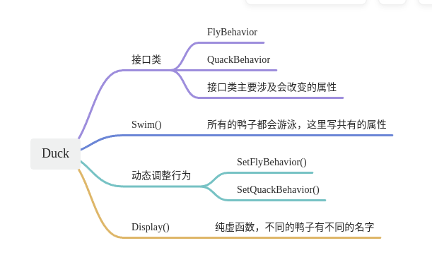

# Design-Mode-Head-First-
设计模式学习（Head First）C++代码实现

# 编译
在每个项目中执行以下命令：
```
mkdir build  
cd build  
cmake ..
make -j8
```
执行：  
在对应项目CMakeLists.txt中找到project的名字，执行：
```
./xxx_design_pattern // 01项目就是./duck_design_pattern
```
# 01-Duck



